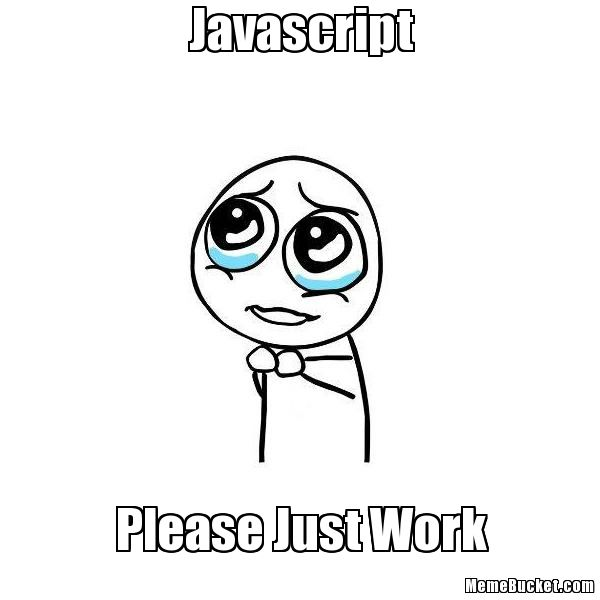

## 0x12. JavaScript - Warm up

> As the Name Suggests, this is essentially my start of Javascript with ALX


The linter Used to check for Javascript code:
[](https://github.com/standard/semistandard)

### Background Context
> JavaScript is used for many things. Here, you will use JavaScript for 2 reasons:

* Scripting (same as we did with Python)
* Web front-end
* For the moment, and for learning all basic concepts of this language, we will do some scripting. After, we will make * our AirBnB project dynamic by using Javascript and JQuery.


### Installation of Node

```
$ curl -sL https://deb.nodesource.com/setup_14.x | sudo -E bash -
$ sudo apt-get install -y nodejs
```
### Installation of Semi-Standard
```
$ sudo npm install semistandard --global
```

### Tasks

> Mandatory Tasks
```
0.First constant, first print
1.1.3 languages
2. Arguments
3. Value of my argument
4. Create a sentence
5. An Integer
6. Loop to languages
7. I love C
8. Square
9. Add
10. Factorial
11. Second biggest!
12. Object
13. Addfile


```
